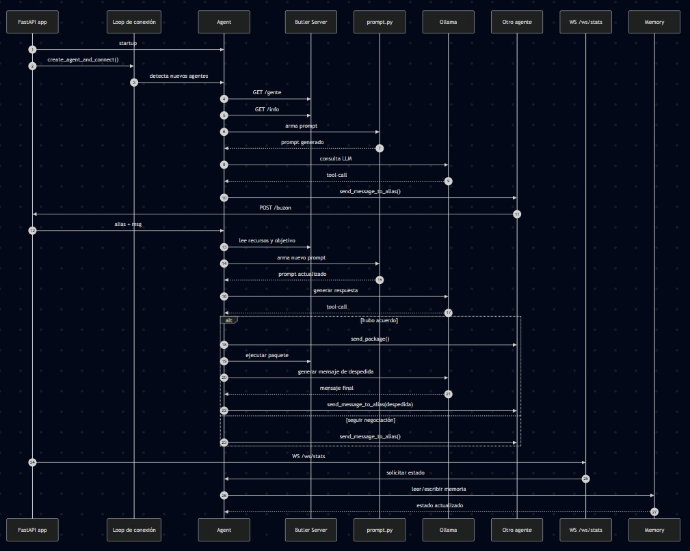

# Sistema de Negociación Multi-Agente con LLM

Sistema distribuido de agentes autónomos que negocian e intercambian recursos entre sí mediante lenguaje natural, utilizando un modelo de lenguaje local (Ollama + llama3.2:3b) y la plataforma Butler como gestor de recursos.

**Autores:**Iremar Luhetsy Rivas Álvarez y Cristhian Iván Cola Pilicita

---

## Índice

1. [Descripción general](#1-descripción-general)
2. [Arquitectura del sistema](#2-arquitectura-del-sistema)
3. [Estructura del proyecto](#3-estructura-del-proyecto)
4. [Requisitos previos](#4-requisitos-previos)
5. [Configuración](#5-configuración)
6. [Despliegue con Docker](#6-despliegue-con-docker)
7. [Ejecución en local](#7-ejecución-en-local)
8. [Flujo de negociación](#8-flujo-de-negociación)
9. [API del agente](#9-api-del-agente)
10. [Panel de control (Dashboard)](#10-panel-de-control-dashboard)
11. [Gestión de memoria](#11-gestión-de-memoria)
12. [Tests](#12-tests)
13. [Dependencias](#13-dependencias)

---

## 1. Descripción general

Cada agente del sistema:

- Se registra en el servidor Butler con un alias único.
- Consulta periódicamente qué otros agentes están conectados.
- Al detectar un nuevo agente, inicia automáticamente una negociación enviando un saludo con su oferta inicial.
- Utiliza un LLM (llama3.2:3b vía Ollama) para generar y responder propuestas en español natural.
- Cierra tratos enviando paquetes de recursos a través del servidor Butler.
- Expone un panel web en tiempo real para inspeccionar mensajes, prompts enviados al LLM y estado de los recursos.

La negociación sigue reglas estrictas: cada agente solo puede **dar** recursos que le sobran y **pedir** recursos que le faltan para alcanzar su objetivo.

---

## 2. Arquitectura del sistema

```
┌──────────────────────────────────────────────────────────────────┐
│                       BUTLER SERVER :7719                        │
│   Gestión de alias · Inventario de recursos · Envío de paquetes  │
│   GET /gente · GET /info · POST /alias/{alias}                   │
│   POST /paquete/{alias}                                          │
└────────────────┬─────────────────────────────────┬──────────────┘
                 │ HTTP REST                        │ HTTP REST
      ┌──────────▼───────────┐           ┌──────────▼───────────┐
      │   AGENTE-UNO (gato)  │           │  AGENTE-DOS (perro)  │
      │      :7721 → :7720   │           │     :7722 → :7720    │
      ├──────────────────────┤           ├──────────────────────┤
      │  FastAPI + WebSocket │◄─────────►│ FastAPI + WebSocket  │
      │  POST /buzon         │  HTTP P2P │ POST /buzon          │
      │  GET  /ws/stats      │           │ GET  /ws/stats       │
      │  Ollama llama3.2:3b  │           │ Ollama llama3.2:3b   │
      └──────────────────────┘           └──────────────────────┘
                 │                                  │
      ┌──────────▼──────────────────────────────────▼──────────┐
      │                    NAVEGADOR WEB                        │
      │  Panel de recursos · Historial de mensajes              │
      │  Inspector de prompts · Log de errores en tiempo real   │
      └─────────────────────────────────────────────────────────┘

      Servicio externo: OLLAMA en http://<host>:11434
```

### Diagrama de secuencia

El siguiente diagrama muestra la interacción completa entre todos los componentes del sistema, desde el arranque hasta el cierre de un ciclo de negociación:



### Componentes principales

| Componente | Responsabilidad |
|---|---|
| `ButlerService` | Cliente REST al servidor Butler; gestión de alias, recursos e intercambio de paquetes |
| `Agent` | Coordinación de estado, turnos, locks y ciclos de negociación; llama a `LLMClient` |
| `LLMClient` | Conexión a Ollama con reintentos y backoff exponencial; aislado de la lógica de negociación |
| `negotiation.py` | Funciones puras sin estado: detección de ofertas, validación de mensajes, construcción de prompts |
| `Memory` | Almacén dual: sesión activa (contexto LLM) + archivo histórico (dashboard) |
| `FastAPI app` | Expone `/buzon` para recibir mensajes P2P y `/ws/stats` para el dashboard |
| `prompt.py` | Plantillas de sistema (`GREETING_PROMPT`, `NEGOTIATOR_PROMPT`) y esquema de herramientas |

---

## 3. Estructura del proyecto

```
fdi-dasi-cris-ire/
├── docker-compose.yml          # Orquestación: Butler + agente-uno + agente-dos
├── Dockerfile                  # Imagen base Python 3.12 + uv
├── pyproject.toml              # Metadatos y dependencias del proyecto
├── pyrightconfig.json          # Configuración de tipos para el IDE (extraPaths: fdi-dasi)
├── .env                        # Variables de entorno (no incluido en git)
│
├── fdi-dasi/
│   ├── main.py                 # Punto de entrada FastAPI (lifespan, rutas)
│   │
│   ├── core/
│   │   ├── config.py           # Configuración vía Pydantic Settings + .env
│   │   ├── prompt.py           # Prompts del sistema y definición de herramientas LLM
│   │   └── negotiation.py      # Funciones puras: detección de ofertas, validación, builders de prompt
│   │
│   ├── services/
│   │   ├── agent.py            # Clase Agent: coordinación de estado, turnos y ciclos
│   │   ├── llm_client.py       # Clase LLMClient: conexión Ollama con reintentos y backoff
│   │   ├── butler_service.py   # Clase ButlerService: REST client y lógica de recursos
│   │   └── memory.py           # Clase Memory: historial activo y archivo histórico
│   │
│   ├── schemas/
│   │   └── agent_message.py    # Modelo Pydantic para mensajes entrantes en /buzon
│   │
│   ├── templates/
│   │   └── index.html          # Dashboard web (Jinja2 + WebSocket)
│   │
│   └── static/css/
│       └── style.css           # Estilos del dashboard
│
└── tests/
    ├── conftest.py                  # Fixtures compartidos y helpers de respuesta LLM
    ├── test_agent_negotiation.py    # Lógica del Agent (LLM y Butler mockeados)
    ├── test_butler_service.py       # ButlerService (HTTP mockeado)
    ├── test_api_endpoints.py        # Endpoints FastAPI
    └── test_ollama_integration.py   # Integración real con Ollama (@ollama)
```

---

## 4. Requisitos previos

- **Python 3.12+** con [uv](https://github.com/astral-sh/uv) como gestor de paquetes
- **Docker** y **Docker Compose** (para despliegue en contenedores)
- **Ollama** instalado y corriendo con el modelo `llama3.2:3b` descargado:
  ```bash
  ollama pull llama3.2:3b
  ```
- Acceso de red al **servidor Butler** (incluido en Docker Compose o levantado externamente)

---

## 5. Configuración

Crear un archivo `.env` en la raíz del proyecto con las siguientes variables:

```env
# Identidad del agente
AGENT_NAME=GATO

# Modelo LLM (debe estar disponible en el servidor Ollama)
LLM_MODEL=llama3.2:3b

# Puerto en el que escucha este agente
PORT=7720

# Entorno de ejecución: "development" o "production"
MODE=development

# URLs del servidor Butler según entorno
DEVELOPMENT_URL_BUTLER_SERVER=http://localhost:7719
PRODUCTION_URL_BUTLER_SERVER=http://147.96.80.104:7719

# Host del servidor Ollama
OLLAMA_HOST=http://localhost:11434

# Puerto al que otros agentes envían mensajes (P2P)
EXTERNAL_AGENT_PORT=7720

# Parámetros de negociación
MAX_NEGOTIATION_TURNS=5     # Máximo de rondas por negociación
MAX_RESUME_MEMORY=3         # Intercambios antes de resumir el historial con el LLM
```

> **Nota:** En el despliegue Docker, las variables `AGENT_NAME` y `OLLAMA_HOST` se sobreescriben directamente en `docker-compose.yml` por servicio.

---

## 6. Despliegue con Docker

El archivo `docker-compose.yml` define tres servicios con perfiles independientes:

| Servicio | Perfil | Puerto | Descripción |
|---|---|---|---|
| `butler-server` | *(siempre activo)* | 7719 | Servidor Butler de gestión de recursos |
| `agent-one` | `gato` / `agents` | 7721→7720 | Agente con alias `gato` |
| `agent-two` | `perro` / `agents` | 7722→7720 | Agente con alias `perro` |

### Comandos habituales

```bash
# Levantar solo el servidor Butler
docker compose up butler-server

# Levantar Butler con reconstrucción de imagen
docker compose up butler-server --build

# Levantar ambos agentes (usa el perfil "agents")
docker compose --profile agents up --build

# Levantar solo el agente "gato"
docker compose --profile gato up --no-deps agent-one

# Levantar solo el agente "perro"
docker compose --profile perro up --no-deps agent-two

# Reiniciar el agente "gato" sin reconstruir
docker compose --profile gato restart agent-one

# Detener todos los agentes
docker compose --profile agents down
```

---

## 7. Ejecución en local

### Instalar dependencias

```bash
uv sync
```

### Levantar el servidor Butler

```bash
uv run fdi-pln-butler server --host 0.0.0.0
```

### Ejecutar un agente

```bash
# Desde el directorio fdi-dasi/
uv run main.py

# O desde la raíz del proyecto
uv run --env-file .env fdi-dasi/main.py
```

El agente estará disponible en `http://localhost:7720`.

---

## 8. Flujo de negociación

> Para una vista detallada de la interacción entre componentes, consulta el [diagrama de secuencia](fdi-dasi/docs/diagram.jpeg).

### Ciclo completo

```
Inicio
  │
  ├─ Registro del alias en Butler
  │
  ├─ Bucle de detección (cada 5 segundos)
  │     └─ Nuevo agente detectado → _greet()
  │           └─ LLM genera saludo con oferta inicial
  │                 └─ send_message_to_alias
  │
  ├─ Recepción de mensaje (POST /buzon)
  │     └─ _negotiate()
  │           │
  │           ├─ Detectar oferta incompatible (has_offer_signal + mentions_any)
  │           │     2 turnos incompatibles consecutivos → despedida automática
  │           │
  │           ├─ Analizar mensaje: ¿oferta cerrable? (detect_close_resource)
  │           │     "acepto"/"trato" → cierre directo
  │           │     palabras después de "por" en sobrantes → cierre
  │           │     palabras entre señal de oferta y "por" en faltantes → cierre
  │           │
  │           ├─ Si se puede cerrar → tools = [send_package solamente]
  │           │     user_prompt: "CIERRA EL TRATO. Llama send_package(...)"
  │           │
  │           └─ Si no → tools = [send_message_to_alias solamente]
  │                 user_prompt: "Propón: Te doy 1 X por 1 Y, ¿aceptas?"
  │
  ├─ Llamada al LLM con hasta 3 reintentos progresivos
  │     Intento 1: nudge corto
  │     Intento 2: nudge con sintaxis explícita de la herramienta
  │     Intento 3: instrucción OBLIGATORIO con firma exacta
  │
  └─ Cierre del ciclo
        ├─ Trato cerrado: send_package → despedida positiva → reset
        └─ Límite de turnos: despedida → reset
```

### Detección de oferta cerrable (`detect_close_resource`)

El agente analiza cada mensaje entrante con tres comprobaciones en orden:

1. **Aceptación directa** — si el mensaje contiene "acepto", "trato" o "de acuerdo" sin negación previa → cerrar enviando el primer sobrante.
2. **Recurso pedido** (`after_por`) — palabras después de "por": si alguna coincide con nuestros sobrantes → cerrar enviando ese recurso.
3. **Recurso ofrecido** (`after_offer`) — palabras entre la señal de oferta ("te doy", "ofrezco", "cambio") y "por": si alguna coincide con nuestros faltantes → cerrar enviando el primer sobrante.

### Restricción simétrica de herramientas

| Situación | Herramientas disponibles para el LLM |
|---|---|
| Oferta cerrable detectada | Solo `send_package` — el LLM no puede escapar a otra propuesta |
| Sin oferta cerrable | Solo `send_message_to_alias` — el LLM no puede cerrar prematuramente |

### Detección de bucle incompatible

Si el agente recibe **2 mensajes consecutivos** con señal de oferta que no mencionan ninguno de sus faltantes (recursos incompatibles), cierra el ciclo con despedida sin llamar al LLM. El contador se reinicia cuando llega una oferta compatible.

### Herramientas disponibles para el LLM

| Herramienta | Cuándo usarla | Argumentos clave |
|---|---|---|
| `send_message_to_alias` | Proponer o contraprostar | `alias`, `mensaje` (máx. 12 palabras) |
| `send_package` | Cerrar el trato | `alias`, `package` (`{"recurso": 1}`) |

---

## 9. API del agente

### Endpoints HTTP

| Método | Ruta | Descripción |
|---|---|---|
| `GET` | `/` | Interfaz web del panel de control |
| `POST` | `/buzon` | Recibe un mensaje de otro agente |
| `WebSocket` | `/ws/stats` | Flujo de estado en tiempo real (cada 1 segundo) |

### `POST /buzon`

**Body:**
```json
{ "msg": "Te doy 1 aceite por 1 queso, ¿aceptas?" }
```

El remitente se identifica por IP. El sistema resuelve el alias consultando Butler (`GET /gente`).

### Formato del evento WebSocket (`/ws/stats`)

```json
{
  "agent_name": "GATO",
  "resources": {
    "actual":   { "aceite": 5, "queso": 1 },
    "objetivo": { "aceite": 2, "queso": 4 },
    "faltante": { "queso": 3 },
    "sobrante": { "aceite": 3 }
  },
  "memory": {
    "PERRO": {
      "messages": [ { "role": "user", "content": "..." } ],
      "prompts":  [ { "type": "negotiation", "executed": true, "output_tool_calls": [...] } ]
    }
  },
  "errors": [
    { "ts": "2026-05-18T15:01:46", "category": "turn_lost", "message": "...", "alias": "PERRO" }
  ]
}
```

---

## 10. Panel de control (Dashboard)

Accesible en `http://localhost:<PORT>/` una vez levantado el agente.

### Secciones

| Sección | Descripción |
|---|---|
| **Recursos** | Inventario actual, objetivo, faltantes y sobrantes actualizados en tiempo real |
| **Lista de agentes** | Agentes con los que se ha negociado; buscador integrado |
| **Mensajes** | Historial de la conversación con filtros: todos / enviados / recibidos / eventos |
| **Prompts** | Traza completa de cada llamada al LLM: mensajes de entrada, respuesta del modelo, tool-calls, estado de validación |
| **Errores** | Buffer circular (máx. 100 entradas) con timestamp, categoría, alias y traceback |

---

## 11. Gestión de memoria

El sistema utiliza un almacén dual:

| Tipo | Propósito | Ciclo de vida |
|---|---|---|
| **Sesión activa** (`active_sessions`) | Contexto enviado al LLM en cada llamada | Se borra al cerrar cada ciclo de negociación |
| **Archivo histórico** (`archive_sessions`) | Historial completo visible en el dashboard | Nunca se borra; crece con separadores de ciclo |

### Resumen automático del contexto

Cuando el historial activo supera `MAX_RESUME_MEMORY` intercambios, el agente llama al LLM con un prompt de resumen que condensa la negociación en un máximo de 3 frases. Si el resumen falla, se usan los últimos `MAX_RESUME_MEMORY` mensajes como respaldo.

---

## 12. Tests

El proyecto incluye una suite de tests de integración organizada en tres niveles: tests sin dependencias externas (rápidos), tests con mocks HTTP, y tests con Ollama real.

### Estructura

```
tests/
├── conftest.py                  # Fixtures compartidos y helpers de respuesta LLM
├── test_agent_negotiation.py    # Lógica del Agent (LLM y Butler mockeados)
├── test_butler_service.py       # ButlerService (HTTP mockeado con respx/responses)
├── test_api_endpoints.py        # Endpoints FastAPI (/buzon, /ws/stats, /)
└── test_ollama_integration.py   # Integración real con Ollama (marcados con @ollama)
```

### Cobertura por archivo

| Archivo | Tests | Qué cubre |
|---|---|---|
| `test_agent_negotiation.py` | 25 | Detección de oferta cerrable, envío de paquete, propuestas, reintentos ×3, límite de turnos, bucle incompatible, saludo |
| `test_butler_service.py` | 16 | Parseo de recursos, resolución de alias por IP, `send_message_to_alias`, `send_package`, sanitización de mensajes |
| `test_api_endpoints.py` | 8 | `GET /`, `POST /buzon` (202 Accepted), `WebSocket /ws/stats` |
| `test_ollama_integration.py` | 11 | Conectividad Ollama, `_call_llm`, flujo completo de negociación, resumen de contexto |

### Dependencias de desarrollo

Las dependencias de testing se instalan con:

```bash
uv sync --group dev
```

| Paquete | Uso |
|---|---|
| `pytest` + `pytest-asyncio` | Runner y soporte async/await |
| `respx` | Mock de llamadas `httpx` (P2P entre agentes y envío de paquetes) |
| `responses` | Mock de llamadas `requests` (consultas síncronas al Butler) |

### Cómo ejecutar

```bash
# Todos los tests (incluye Ollama si está disponible)
uv run pytest

# Solo tests rápidos, sin Ollama
uv run pytest -m "not ollama"

# Solo tests con Ollama real
uv run pytest -m ollama -v

# Un archivo concreto
uv run pytest tests/test_agent_negotiation.py -v

# Un test individual
uv run pytest tests/test_agent_negotiation.py::TestRetryMechanism::test_reintenta_hasta_3_veces_si_falla -v
```

### Tests con Ollama (`-m ollama`)

Estos tests usan el servidor Ollama y el modelo reales. Se **saltan automáticamente** si Ollama no está disponible o si el modelo no está descargado, sin interrumpir el resto de la suite.

| Test | Qué verifica |
|---|---|
| `test_ollama_responde_en_api_tags` | Ollama está corriendo y responde |
| `test_modelo_configurado_disponible` | El modelo del `.env` está descargado |
| `test_llm_devuelve_respuesta` | `_call_llm` obtiene una respuesta de texto |
| `test_llm_acepta_prompt_en_espanol` | El LLM procesa prompts en español |
| `test_llm_genera_tool_call_con_herramientas` | Con herramientas disponibles, el LLM produce tool-calls o texto |
| `test_negotiate_produce_accion` | La negociación real ejecuta alguna acción |
| `test_negotiate_cierra_con_oferta_valida` | Una oferta válida dispara el flujo de cierre |
| `test_negotiate_send_package_usa_sobrante_valido` | Si se envía un paquete, el recurso está en los sobrantes |
| `test_greet_ejecuta_el_flujo_completo` | El saludo completa el flujo sin excepciones |
| `test_build_context_resume_historial_largo` | El historial largo se resume con el LLM |
| `test_build_context_vacio_sin_historial` | Sin historial, el contexto es vacío |

> **Nota sobre no-determinismo:** Los tests con Ollama verifican que el flujo se ejecuta correctamente, no el contenido exacto de las respuestas del LLM. Un modelo pequeño puede no llamar siempre a la herramienta correcta; en ese caso los tests comprueban que el agente registra el error adecuadamente en lugar de fallar silenciosamente.

---

## 13. Dependencias

| Paquete | Versión mínima | Uso |
|---|---|---|
| `fastapi[standard]` | 0.133.1 | Framework web y WebSocket |
| `uvicorn` | 0.41.0 | Servidor ASGI |
| `ollama` | 0.6.1 | Cliente asíncrono para el servidor Ollama |
| `httpx` | 0.28.1 | Cliente HTTP asíncrono para comunicación P2P |
| `requests` | 2.32.5 | Cliente HTTP síncrono para consultas a Butler |
| `pydantic-settings` | 2.13.1 | Gestión de configuración desde `.env` |
| `loguru` | 0.7.3 | Logging estructurado |

Gestión de dependencias con [uv](https://github.com/astral-sh/uv). Para instalar:

```bash
uv sync
```
