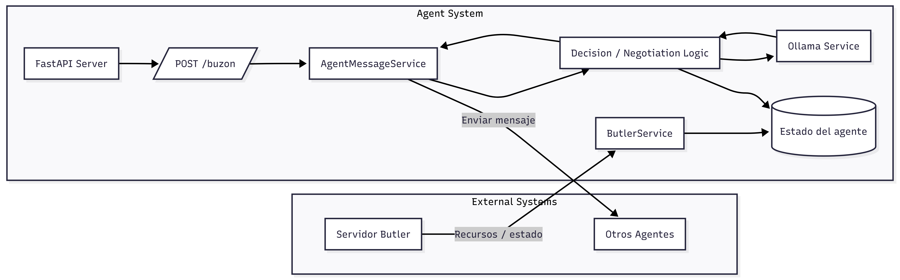
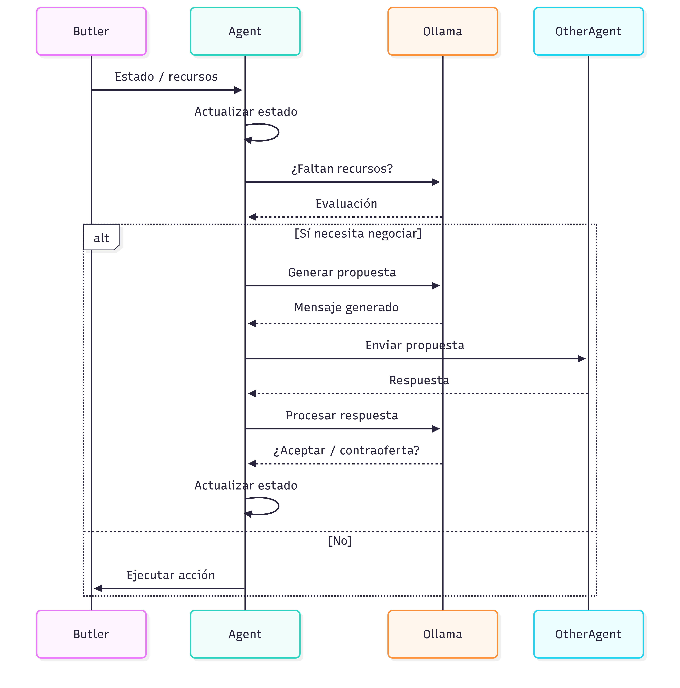

# Arquitectura del Proyecto

> Documento de arquitectura y tecnologías del desarrollo de un agente inteligente con capacidad de negociar. 

---

# 1. Visión General

El proyecto consiste en desarrollar un agente inteligente con capacidad de negociar con otros agentes, con el objetivo de llegar a un objetivo. 

En este caso, cada agente obtiene una serie de recursos de un servidor (Butler) y se comunican con los demás agentes y negocian con ellos por medio de prompts. 

# 2. Arquitectura del Sistema

## 2.1 Diagrama de Arquitectura General

La arquitectura del sistema es la siguiente:

La arquitectura del programa se puede dividir en dos áreas: el área interna, que implementa todas las funcionalidades necesarias del agente en diferentes servicios, y el área externa, la cual incluye los sistemas ajenos al agente.

En este proyecto, los sistemas externos son el servidor de Butler, el cual se reciben los recursos y el estado, y los demás agentes, que tienen que poder comunicarse entre ellos para poder realizar las negociaciones. 

En cuanto al área interna, el agente está compuesto de los siguientes servicios:

- **Servidor FastAPI**:
Actúa como punto de entrada del agente. Se encarga de exponer los endpoints HTTP necesarios para la comunicación con otros agentes, permitiendo recibir y gestionar mensajes externos.

- **Endpoint /buzon**:
Representa el canal de recepción de mensajes de otros agentes. Funciona como un buzón donde llegan las propuestas, respuestas o solicitudes de negociación, activando el procesamiento interno del agente.

- **AgentMessageService**:
Gestiona la comunicación entre agentes. Se encarga de procesar los mensajes entrantes, estructurar las respuestas y enviar mensajes a otros agentes siguiendo el protocolo definido. Abstrae los detalles de red de la lógica del agente.

- **ButlerService**:
Permite la interacción con el servidor de Butler. Su función es obtener el estado actual de la simulación (recursos, entorno, etc.) y enviar las acciones que el agente decide ejecutar.

- **Decision / Negotiation Logic**:
Constituye el núcleo de inteligencia del agente. Evalúa el estado actual, determina si es necesario negociar, decide las acciones a realizar y gestiona la estrategia de negociación en función de los objetivos del agente.

- **OllamaService**:
Encapsula la interacción con el modelo de lenguaje. Se encarga de construir los prompts adecuados y generar mensajes de negociación. Su uso está limitado a la generación de lenguaje, sin intervenir directamente en la toma de decisiones.

- **Gestor de estado del agente**:
Mantiene la información interna necesaria para la toma de decisiones, como los recursos disponibles, los objetivos definidos y el historial de interacciones. Es consultado y actualizado continuamente por el resto de servicios.

En cuanto al flujo de datos, la información sale de Butler y va al agente, donde se actualiza el estado y se comprueba si faltan recursos. En el caso de que falten recursos, se genera una propuesta con ollama y se recibe el mensaje generado. Una vez recibido, el mensaje se envía a otro agente, y se procesa la respuesta recibida para comprobar si es factible aceptar la oferta o, en caso contrario, se realiza una contraoferta. Una vez realizada la negociación, se actualiza el estado y se ejecuta la acción con Butler.

# 3. Tecnologías utilizadas

## 3.1 Python
Python es el lenguaje elegido para realizar el proyecto, ya que es simple y tiene un ecosistema de librerías bastante amplio. Las librerías que se han utilizado en el desarrollo del programa son las siguientes:

- FastAPI: creación de la API REST del agente.

- Requests / HTTPX: realización de peticiones HTTP para la comunicación con el servidor de Butler y otros agentes.

- Loguru: gestión de logs del sistema.

- Async: Gestión de concurrencia del sistema, utilizado en el buzón.

- Ollama (cliente Python): interacción con el modelo de lenguaje para la generación de texto.

## 3.2 Ollama

Ollama se utiliza para ejecutar localmente modelos de lenguaje. En este caso, se utiliza para generar mensajes de negociación para enviarlos a los demás agentes.

## 3.3 FastAPI

Mediante FastAPI se implementa una interfaz de comunicación del agente mediante una API REST. El agente expone endpoints HTTP que permiten recibir mensajes de otros agentes (como, por ejemplo, mediante el endpoint /buzon). 

## 3.4 UV

UV es una herramienta de gestión de dependencias y ejecución de entornos para Python. Se utiliza para gestionar las librerías del proyecto de forma eficiente y reproducible, permitiendo instalar dependencias, ejecutar scripts y mantener un entorno controlado para el desarrollo y la ejecución del agente.

## 3.5 Loguru

Loguru es una librería de logging que simplifica la gestión de registros en la aplicación. Se utiliza para generar trazas del comportamiento del agente, facilitando la depuración y el análisis de su funcionamiento durante la simulación.
